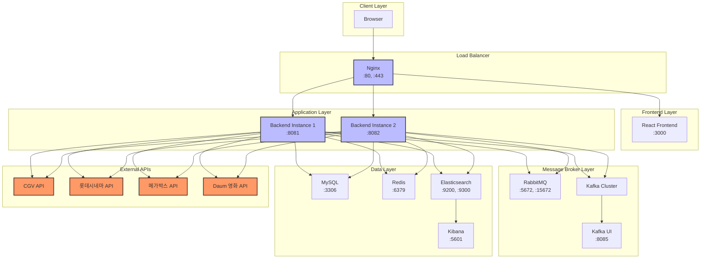

# 🎬 CineFinder — 영화관 통합 상영 정보 서비스
**CineFinder**는 전국의 CGV, 롯데시네마, 메가박스의 상영 정보를
한 눈에 비교하고 검색할 수 있는 통합 영화 정보 서비스입니다.
## 💡 주요 기능
🎯 **통합 상영 정보 검색**
- 3대 멀티플렉스(CGV, 롯데시네마, 메가박스)의 상영 정보를 한번에 확인
- 위치 기반으로 가까운 영화관 찾기
- 시간대별, 영화별 필터링 기능 제공

🗺️ **위치 기반 서비스**
- Elasticsearch Geo-point를 활용한 반경 검색
- 사용자 주변의 영화관 실시간 검색
- 거리, 위치 기반 맞춤 추천

🎫 **실시간 좌석 정보**
- 영화관별 잔여 좌석 수 실시간 확인
- 상영관 종류 및 총 좌석 수 정보 제공
- 시간대별 예매 가능 여부 확인

## 🛠 기술 스택
### Backend
- **Framework:** Spring Boot
- **ORM:** Spring Data JPA
- **Database:**
    - MySQL (메인 데이터베이스)
    - Elasticsearch (위치 기반 검색)
    - Redis (캐싱 및 JWT 토큰, DB lock, 세션 관리)
- **Message Queue:**
    - Kafka (비동기 데이터 처리, 로그 수집 등)
    - RabbitMQ (경량 메시지 처리 및 알림 시스템 등)
- **Realtime Communication:**
    - WebSocket (실시간 데이터 전송, 채팅 등)
- **Authentication & Authorization:**
    - Spring Security (보안 설정 및 접근 제어)
    - JWT (토큰 기반 인증 및 인가)
    - OAuth 2.0 (소셜 로그인 연동 – Kakao 로그인 구현)
- **API:** RESTful API

### DevOps
- **Version Control:** Git
- **CI/CD:** Docker
- **Proxy:** Nginx

### External APIs
- CGV API
- 롯데시네마 API
- 메가박스 API
- Daum 영화 API
- KOBIS API
- KMDB API

## 🎯 시스템 구조

## 📊 성과
- 3개 멀티플렉스사의 실시간 상영 정보 통합
- Elasticsearch를 활용한 빠른 위치 기반 검색 구현
- 영화 정보 자동 동기화 시스템 구축
